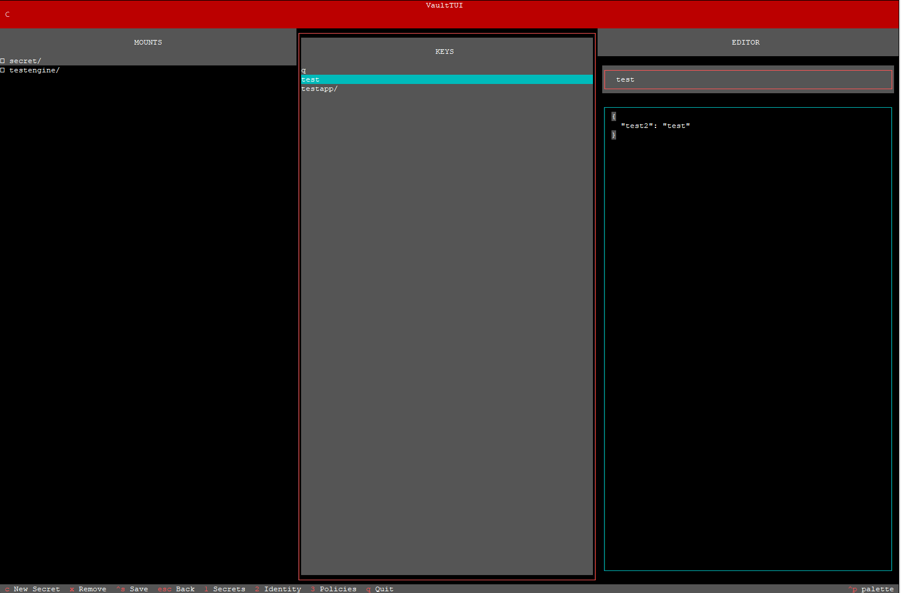
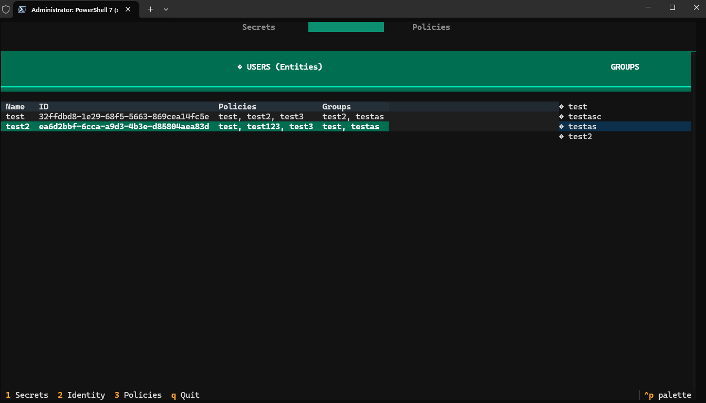
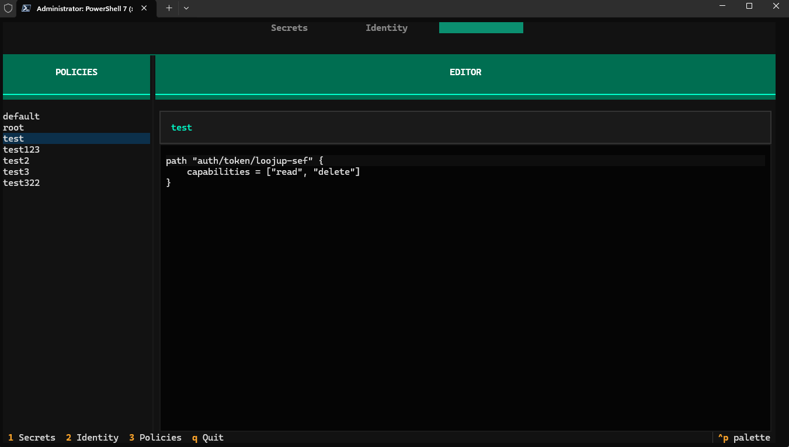

# v4t - Terminal Ui for Hashicorp Vault

## Functions
1. Add/Edit/Delete/Copy/Move secrets
2. List all users
3. Add user inte to groups
4. Add/Edit/Delete policies
5. Add/Remove policis from groups and users

## Known bugs:

1. esc during policis not working as it should
2. when adding policy, it does not directley refresh the list
3. probably some more, not everything is 100% tested.

## Prepare for build
```
pip install -e ".[build]"
```

## Prepared for whl file
```
python3 -m build --sdist --wheel .
pip install dist/v4t-0.1.0-py3-none-any.whl
```

## prepared for binary
```
pip install pyinstaller

# Linux:
pyinstaller --onefile --name v4t --add-data "styles.tcss:." app.py

# Windows:
pyinstaller --onefile --name v4t --add-data "styles.tcss;." app.py
```

## Prepared for binary with nuitka, compiles everything as C code.
```
pip install nuitka

# Linux:
python3 -m nuitka --onefile --standalone --include-data-files=app.tcss=app.tcss --output-filename=v4t app.py

# Windows:
python3 -m nuitka --onefile --standalone --include-data-files=app.tcss=app.tcss --output-filename=v4t.exe app.py
```


## Images






